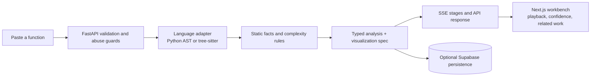
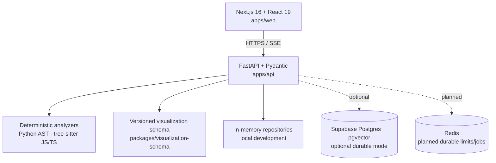

# Complexity Library

**Complexity Library** is an open-source, deterministic-first tool for making code-growth analysis inspectable. Paste a Python, JavaScript, or TypeScript function, then see a structured time/space-complexity result, the static evidence behind it, and a reproducible interactive trace.

It is deliberately not a chatbot. For supported code, the deterministic parser and rule engine are the source of truth; no submitted code is executed, and no LLM is required to use the product.


## What works today

- Static Python, JavaScript, and TypeScript analysis for common O(1), O(log n), O(n), O(n log n), O(n²), O(n³), O(2ⁿ), and O(n!) patterns.
- Typed analysis results: time, auxiliary space, confidence, assumptions, limitations, pattern, and AST-derived signature.
- Server-sent analysis stages and a browser-native visual playback surface.
- Public curated function library, algorithm catalog, comparison view, deterministic similarity, and ten interactive Big-O lessons.
- Anonymous session cookies, request limits, honeypot protection, typed API boundaries, structured/redacted logs, and optional Supabase persistence.
- A local-first development mode that works without Supabase, Redis, or an LLM provider.

## Product flow



## Architecture



The API owns business decisions. The browser renders only validated visualization data and never executes generated code. A shared schema keeps API traces and UI renderers aligned.

## Technology stack

| Area | Technology | Why |
| --- | --- | --- |
| Web | Next.js 16, React 19, TypeScript | App Router UI and a compact interactive workbench |
| API | FastAPI, Pydantic, Uvicorn | Typed, fast Python HTTP/SSE service |
| Parsing | Python `ast`, tree-sitter JS/TS | Deterministic language-aware static analysis |
| Data | Supabase/PostgreSQL/pgvector | Optional durable public library, RLS, and future similarity recall |
| Shared contract | JSON Schema + TypeScript fixture | Versioned visualization boundary |
| Tooling | pnpm, uv, ESLint, pytest, GitHub Actions | Reproducible workspace, lint/type/build/test gates |
| Containers | Docker Compose | Production-shaped local run path |

## Repository layout

```text
apps/
  api/                         FastAPI API and deterministic engine
    app/analysis.py            Language adapters and complexity rules
    app/visualization.py       Bounded trace/spec construction
    app/repositories.py        In-memory and Supabase persistence boundary
    app/main.py                HTTP, SSE, sessions, guards, routes
    tests/                     Engine/API/settings/seed tests
  web/                         Next.js interface
    app/                       App Router routes
    components/                Analyzer, library, compare, learn surfaces
packages/
  visualization-schema/        Versioned JSON Schema and TS contract fixture
supabase/migrations/           RLS, pgvector, function, curation schema
.github/workflows/ci.yml       Lint, typecheck, API tests, production build
```

## Quick start

### Prerequisites

- Node 22 (pinned in `.nvmrc`)
- pnpm 11.9+
- Python 3.12 (pinned in `.python-version`)
- [uv](https://docs.astral.sh/uv/)

### 1. Fork and clone

```bash
gh repo fork harishkotra/complexity-library --clone
cd complexity-library
```

Or fork through GitHub, then clone your fork and add the upstream remote:

```bash
git clone https://github.com/YOUR_HANDLE/complexity-library.git
cd complexity-library
git remote add upstream https://github.com/harishkotra/complexity-library.git
```

### 2. Install dependencies

```bash
pnpm install
cd apps/api && uv sync --extra dev
```

`pnpm install` enables the versioned pre-commit hook. The workspace explicitly allows the audited `unrs-resolver` postinstall build required by the Next.js toolchain.

### 3. Run the API

```bash
cd apps/api
uv run uvicorn app.main:app --reload --port 8000
```

Health check:

```bash
curl http://localhost:8000/health
```

### 4. Run the web app

In a second terminal from the repository root:

```bash
pnpm dev:web
```

Open [http://localhost:3000](http://localhost:3000). The web app calls `http://localhost:8000` by default.

## Use the API directly

```bash
curl -X POST http://localhost:8000/api/functions/analyze \
  -H 'Content-Type: application/json' \
  -d '{
    "language": "python",
    "title": "Binary search",
    "code": "def find(items, target):\n    low, high = 0, len(items) - 1\n    while low <= high:\n        mid = (low + high) // 2\n        if items[mid] == target:\n            return mid\n        if items[mid] < target:\n            low = mid + 1\n        else:\n            high = mid - 1\n    return -1\n"
  }'
```

The response contains a typed result plus a bounded visualization spec:

```json
{
  "analysis": {
    "time_complexity": "O(log n)",
    "space_complexity": "O(1)",
    "pattern": "binary_search",
    "confidence": 0.96
  },
  "visualization": {
    "schema_version": 1,
    "type": "logarithmic_halving",
    "input_size": 16
  }
}
```

For streamed progress, call `POST /api/functions/analyses`, then connect to its returned `events_url` with the anonymous-session cookie.

## Analysis model

The engine does static inspection only. It observes loops, nesting, halving operations, direct recursion, calls, allocations, and selected known idioms such as sorting, binary search, two pointers, and sliding windows.

```python
analysis = analyze_code("python", code)
print(analysis.time_complexity)  # TimeComplexity.LOGARITHMIC
print(analysis.confidence)       # 0.96 for conventional binary search
```

Unsupported or ambiguous constructs reduce confidence and add limitations; they do not trigger code execution or a fabricated claim.

## Configuration and durable mode

Copy `.env.example` and configure values only when you need external services. The deterministic core needs none.

| Variable | Purpose |
| --- | --- |
| `SUPABASE_URL` | Optional Supabase project URL |
| `SUPABASE_SERVICE_ROLE_KEY` | Server-only durable persistence/seed key; never expose to the browser |
| `REDIS_URL` | Planned durable limiter/job backend |
| `LLM_ENABLED` | Defaults to `false`; reserved for constrained fallback work |
| `CORS_ORIGINS` | Comma-separated browser origins |

After applying Supabase migrations, seed curated content:

```bash
cd apps/api
uv run python -m scripts.seed_curated
```

## Test, lint, and build

```bash
# API
cd apps/api && uv run pytest

# From repository root
pnpm lint
./apps/web/node_modules/.bin/tsc --project packages/visualization-schema/tsconfig.json
pnpm build
```

GitHub Actions runs the same web lint, shared-schema typecheck, API tests, and production build on pull requests and pushes to `main`.

## Containers

```bash
docker compose up --build
```

The Compose definition starts the web app at port 3000 and API at port 8000. A working Docker daemon is required; image-build verification is tracked as an open issue.

## Contributing

1. Choose an [open issue](https://github.com/harishkotra/complexity-library/issues), especially `good first issue`, `help wanted`, `area:*`, or `priority:*` labels.
2. Comment on the issue before beginning a substantial change so work is not duplicated.
3. Create a focused branch and keep generated files, secrets, local Markdown planning artifacts, and local service data out of commits.
4. Add regression coverage for every analysis rule, request boundary, or visualization contract change.
5. Run lint, typecheck, tests, and build before opening a PR.

### High-value contributions

- Explicit multi-function selection and richer control-flow/auxiliary-space analysis.
- More curated algorithms, lessons, graph/sorting visualizers, and documented common mistakes.
- PostgreSQL full-text search, cursor pagination, and unified typed search results.
- Durable Supabase/Redis integration, SSE reconnects, and cache/idempotency tests.
- Automated accessibility, visual-regression, E2E, and performance coverage.
- Constrained provider-neutral fallback and moderation work—always treating prompts/code/output as untrusted data.

### Contribution guardrails

- Do not make the product chatbot-first.
- Never execute untrusted submitted code in the application server.
- Preserve deterministic results when a future provider fallback is unavailable or lower confidence.
- Validate every external boundary with Pydantic/schema contracts.
- Keep the anonymous core keyboard-accessible and reduced-motion-aware.

## Roadmap

The MVP is usable now; the remaining V1 work is tracked as [GitHub issues](https://github.com/harishkotra/complexity-library/issues). Issues use `area:*`, `priority:*`, `feature`, `infrastructure`, `blocked`, and `deferred` labels.

Current priorities are analysis correctness, durable persistence/queueing, public discovery/search, visualization accessibility, and end-to-end quality. Deferred ideas—additional language analyzers, code execution, social features, and distributed-systems visualizers—are labeled `deferred` and are intentionally outside V1.

## License

[MIT](LICENSE)
